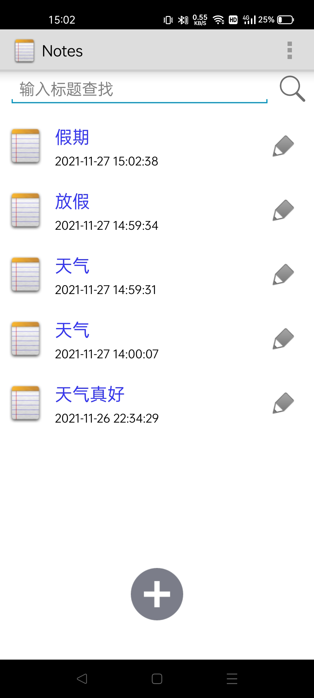
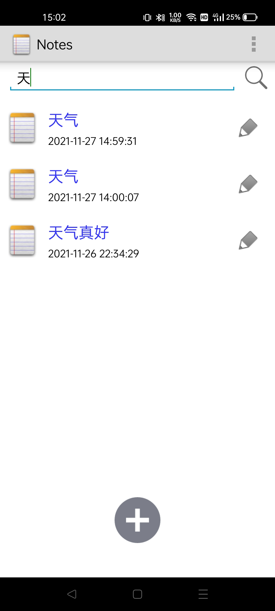
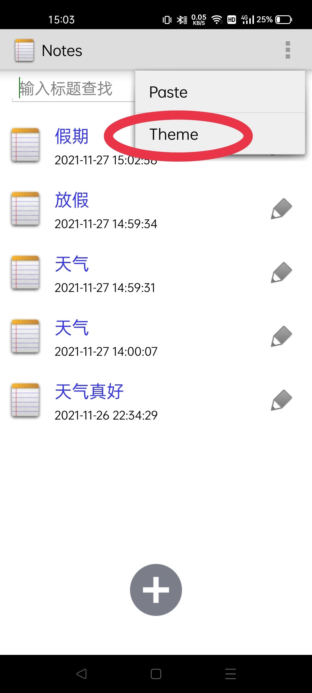
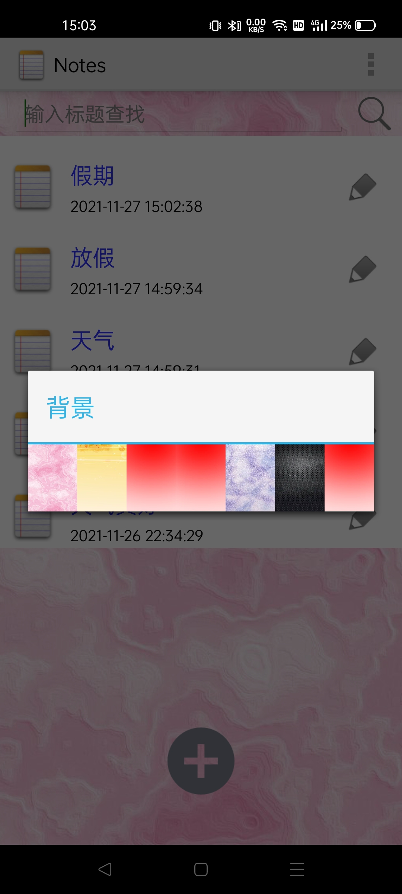
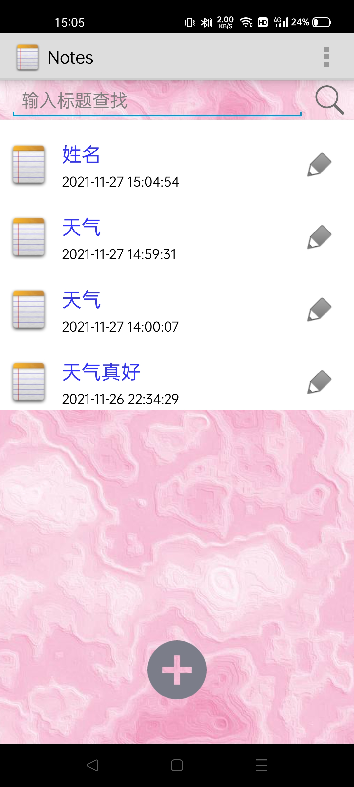
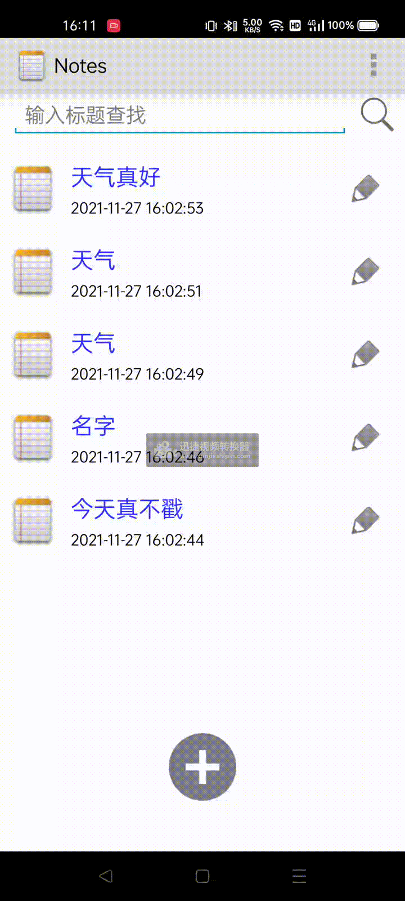
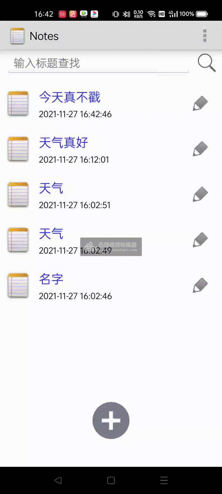
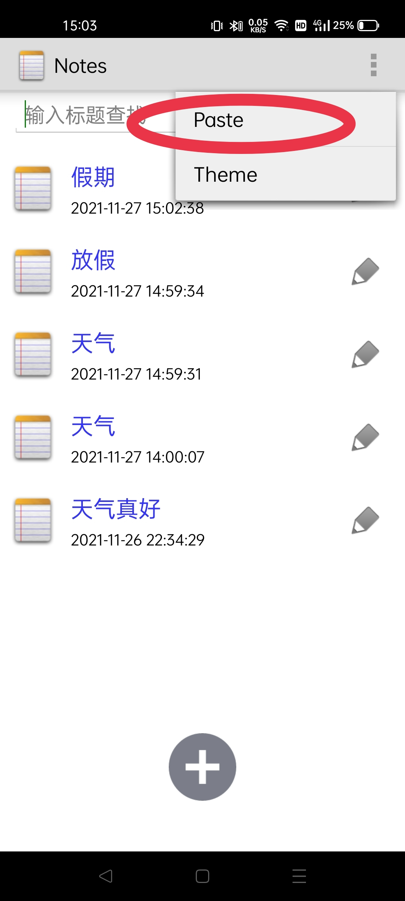
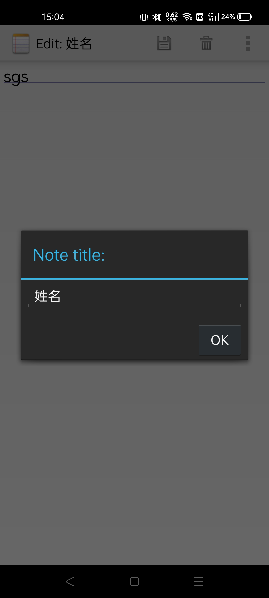

# Android期中

主要功能1：
增加日期显示

效果图：

主要功能2：
增加搜索显示：

效果图：
在搜索栏进行内输入想要搜索的部分，点击搜索按钮即可出现。

重新进入APP或清空搜索栏点击搜索按钮都可以返回NotePad主页面。
附加功能1：
UI美化
效果图：

附加功能2：
更换NotePad背景：

选择更换背景：

选择要更换的背景：

更换完背景效果图：

附加功能3：
偏好设置：
将最近点击的记事本置顶：

附加功能4：
记事本的设置功能：
能够删除不需要的笔记。
效果图：

附加功能5：
笔记分类：
效果图：

报告结束，感谢收看！